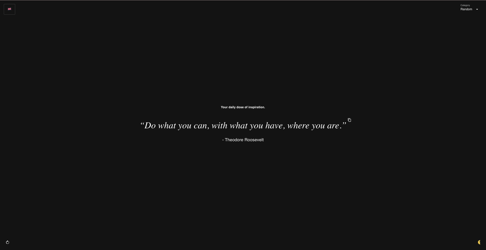

# Random Quotes

A modern web application that displays random quotes, built with Next.js, React 19, and TypeScript.

[](https://codecov.io/gh/jayc13/random-quotes)
[](https://github.com/jayc13/random-quotes/actions/workflows/prod-deployment.yml)

## Live Demo

You can check out the live demo of this application at https://quotes.javiercaballero.info/.

## Screenshots



## Features

- Display random inspirational quotes
- Clean, responsive Material UI interface
- Server-side rendering with Next.js
- Fully tested with Jest and Playwright

## Technologies

- **Frontend**: React 19, Material UI 7, Styled Components
- **Framework**: Next.js 15
- **Testing**: Jest, React Testing Library, Playwright
- **Language**: TypeScript

## Getting Started

### Prerequisites

- Node.js (v18 or higher)
- npm or yarn

### Installation

1. **Clone the repository:**

    ```bash
    git clone https://github.com/jayc13/random-quotes
    cd random-quotes-next
    ```

2. **Install dependencies:**

   ```bash
   npm install
   ```

3. **Run the development server:**

   ```bash
   npm run dev
   ```

The application will be available at http://localhost:3000.

### Available Scripts

* `npm run dev` - Start the development server
* `npm run build` - Build the application for production
* `npm run start` - Start the production server
* `npm run lint` - Run ESLint to check code quality
* `npm run lint-fix` - Automatically fix linting issues
* `npm run test` - Run all tests (unit, integration, and e2e)
* `npm run test-unit` - Run unit tests only
* `npm run test-integration` - Run integration tests only
* `npm run test-e2e` - Run end-to-end tests with Playwright
* `npm run test-e2e-open` - Run end-to-end tests with Playwright UI

### Project Structure

```
random-quotes-next/
├── components/       # React components
├── pages/            # Next.js pages and API routes
├── public/           # Static assets
├── styles/           # Global styles
├── tests/            # Test files
│   ├── e2e/          # Playwright tests
│   ├── integration/  # Integration tests
│   └── unit/         # Unit tests
└── types/            # TypeScript type definitions
```

## Contributing

Contributions are welcome! If you'd like to contribute to this project, please follow these guidelines:

1. **Report Issues:** If you encounter any issues or bugs, please open an issue on the [GitHub repository](https://github.com/jayc13/random-quotes/issues) and provide a detailed description of the problem, including steps to reproduce it.

2. **Suggest Improvements:** If you have any suggestions for improvements or new features, feel free to open an issue on the [GitHub repository](https://github.com/jayc13/random-quotes/issues) and describe your ideas.

3. **Submit Pull Requests:** If you'd like to contribute code changes, please follow these steps:

   - Fork the repository.
   - Create a new branch for your changes: `git checkout -b feature/your-feature-name` or
     `git checkout -b fix/your-fix-name`.
   - Make your changes, following the project's coding style and conventions.
   - Write tests for your changes (if applicable).
   - Run all tests to ensure everything is working correctly: `npm run test` (or the relevant test scripts from
     `package.json`).
   - Commit your changes with a clear and descriptive commit message.
   - Push your changes to your forked repository.
   - Open a pull request to the main branch of the original repository.

Please ensure that your pull request includes a clear description of the changes you've made and any relevant information for reviewers.

## License

This project is licensed under the MIT License. See the [LICENSE](LICENSE) file for details.

## Acknowledgments

- [Next.js](https://nextjs.org/) for the framework
- [React](https://reactjs.org/) for the UI library
- [Material UI](https://mui.com/) for the component library
- [TypeScript](https://www.typescriptlang.org/) for static typing
- [Jest](https://jestjs.io/) for testing
- [Playwright](https://playwright.dev/) for end-to-end testing

## Contact

If you have any questions or need further assistance, you can reach out to the project maintainers at:

- [Javier Caballero (jayc13)](https://github.com/jayc13)